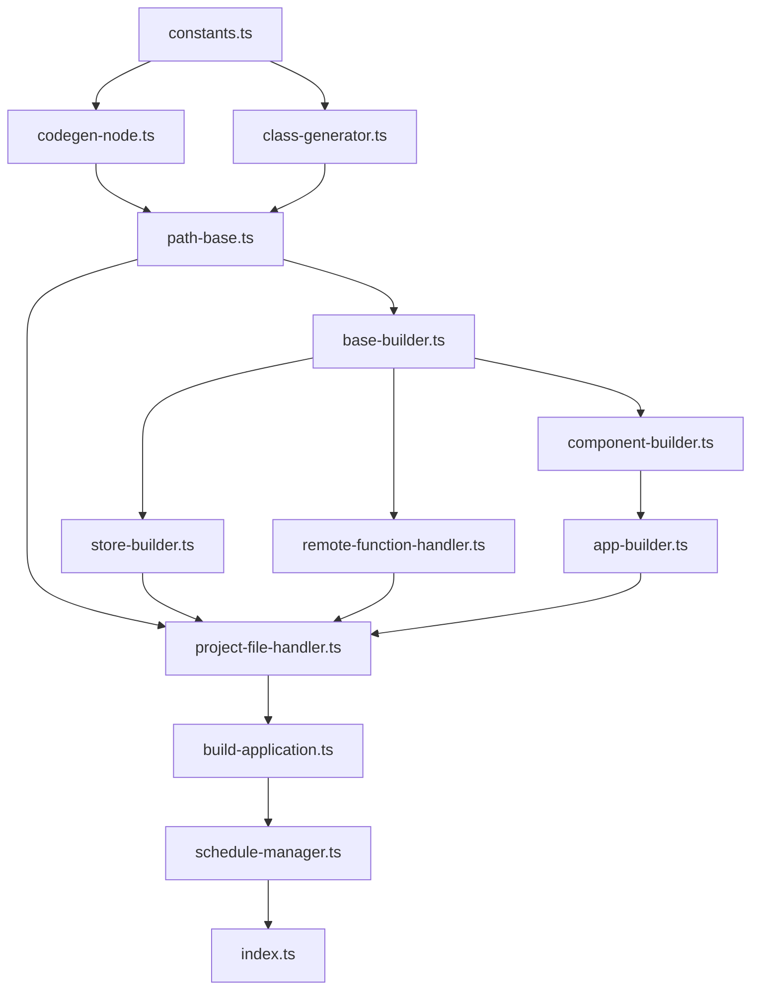

# 重構計畫：`src/index.js` → TypeScript 模組化

## 現狀分析

`src/index.js` 共 **10,722 行**，包含 **11 個 class** + 常數 + 啟動邏輯。

| Class | 行數範圍 | 職責 |
|---|---|---|
| `CodegenNode` | L112–3419 | 核心資料模型，解析 source.js 的每個節點 |
| `ClassGenerator` | L3421–3943 | 產生 JS class 的程式碼檔案 |
| `PathBase` | L3945–4272 | 路徑管理基底，初始化專案結構 |
| `BaseBuilder` | L4274–4518 | 建構器基底，參數/函式名稱工具 |
| `StoreBuilder` | L4520–5029 | MobX Store 程式碼產生器 |
| `RemoteFunctionHandler` | L5031–5608 | Firestore CRUD API 產生器 |
| `ComponentBuilder` | L5610–6661 | React Component 程式碼產生器 |
| `AppBuilder` | L6663–7659 | 完整 App 架構產生器（i18n、Router、Less） |
| `ProjectFileHandler` | L7661–10355 | 專案檔案操作、部署、編譯流程 |
| `BuildApplication` | L10358–10547 | 對外 API 門面，組裝建置流程 |
| `ScheduleManager` | L10549–10708 | 批次排程器，接收 CLI 指令 |

## 重構策略

### 檔案結構

```
src/
├── index.js.back          ← 原始備份
├── index.ts               ← 新進入點（re-export + CLI 啟動）
├── constants.ts           ← 所有常數與設定
├── codegen-node.ts        ← CodegenNode class
├── class-generator.ts     ← ClassGenerator class
├── path-base.ts           ← PathBase class
├── base-builder.ts        ← BaseBuilder class
├── store-builder.ts       ← StoreBuilder class
├── remote-function-handler.ts ← RemoteFunctionHandler class
├── component-builder.ts   ← ComponentBuilder class
├── app-builder.ts         ← AppBuilder class
├── project-file-handler.ts ← ProjectFileHandler class
├── build-application.ts   ← BuildApplication class
└── schedule-manager.ts    ← ScheduleManager class
```

### TypeScript 轉換原則

1. **語法照舊**：保留 class field 語法、箭頭函式、lodash 用法
2. **漸進式型別**：使用 `any` 處理複雜或未知結構，重要參數加上明確型別
3. **保留 JSDoc**：所有中文註解完整保留
4. **不改邏輯**：零行為變更，純結構拆分

### 依賴關係



## 執行步驟

1. ✅ 分析原始碼結構
2. ✅ 重新命名 `index.js` → `index.js.back`
3. ✅ 安裝 TypeScript 相關依賴 (`@babel/preset-typescript`, `typescript`, `@types/lodash`, `@types/node`)
4. ✅ 建立 `tsconfig.json` + 更新 `babel.config.js`
5. ✅ 抽取 `constants.ts` (162 行)
6. ✅ 抽取 `codegen-node.ts` (3,344 行)
7. ✅ 抽取 `class-generator.ts` (559 行)
8. ✅ 抽取 `path-base.ts` (365 行)
9. ✅ 抽取 `base-builder.ts` (280 行)
10. ✅ 抽取 `store-builder.ts` (548 行)
11. ✅ 抽取 `remote-function-handler.ts` (613 行)
12. ✅ 抽取 `component-builder.ts` (1,089 行)
13. ✅ 抽取 `app-builder.ts` (1,036 行)
14. ✅ 抽取 `project-file-handler.ts` (2,740 行)
15. ✅ 抽取 `build-application.ts` (228 行)
16. ✅ 抽取 `schedule-manager.ts` (195 行)
17. ✅ 建立 `index.ts` 統一匯出 (46 行)
18. ✅ 建立 Skill 文件 (`agents/codegen-architect/skill.md`)
19. ✅ Babel 語法驗證通過

> [!TIP]
> 重構完成！原始 `index.js.back` (10,722 行) 已拆分為 13 個模組 (共 11,205 行，含 import/export/JSDoc 新增)。
